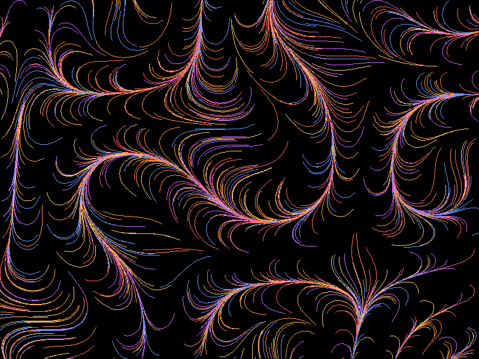
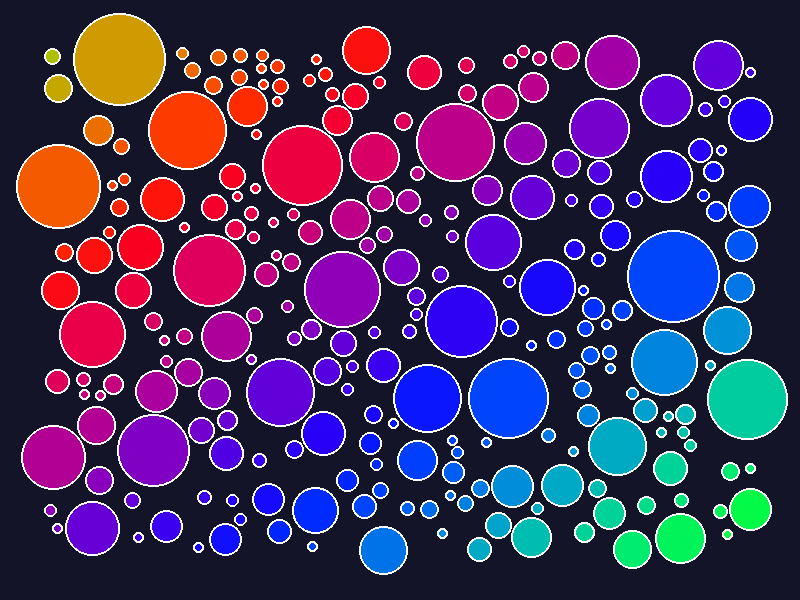
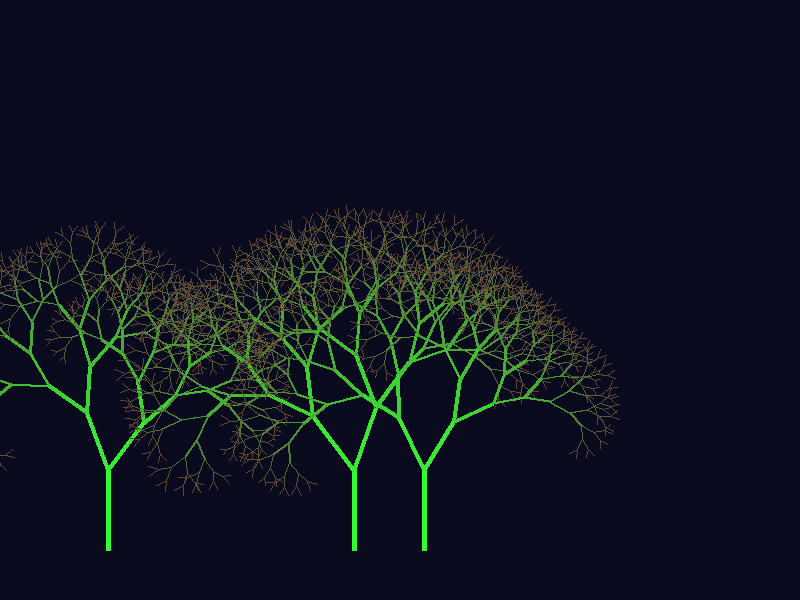

# Generative Art with Rust

A collection of generative art experiments created with Rust and Pyhon.

## Gallery

### Flow Field
Organic flowing lines created by particles following sine/cosine noise functions.



### Circle Packing
Space-filling circles without overlap, colored by position gradient.



### Fractal Trees
Recursive branching with random variation creating organic tree structures.



## Running

### Rust Version
```bash
cd rust_playground
cargo run
```

### Python Version (original)
```bash
python3 generative_art.py
```

## License
MIT - Feel free to use, modify, share!

Created with 💙 by Izzy